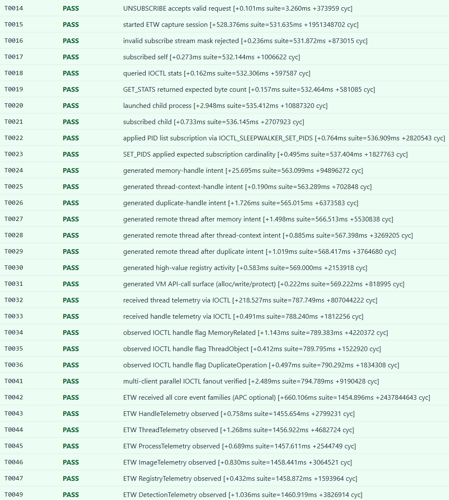

# Sleepwalker Install and Operator Workflow

## Deployment/Validation Visuals

<p align="center">
  
</p>

<p align="center">
  
</p>

## Prerequisites

- Windows VM for analysis/testing
- Visual Studio + WDK (KMDF toolchain)
- Administrative shell
- Test-signing enabled for non-production certs

## Conventions

- `<REPO_ROOT>` means the local folder where you cloned this repository.
- Commands below assume an elevated terminal.

## 1) Build the Driver

Open the solution file (`*.slnx`) in Visual Studio and build:

- Project: `vcxproj/Sleepwalker.vcxproj`
- Platform: `x64`
- Configuration: `Debug` or `Release`

Expected artifacts (default):

- `x64\Debug\sleepwlkr.sys`
- `x64\Debug\Sleepwalker.inf`

## 2) Install the Driver Package

From elevated terminal:

```bat
cd /d "<REPO_ROOT>"
pnputil /add-driver "Sleepwalker.inf" /install
```

Validate package presence:

```bat
pnputil /enum-drivers | findstr /i sleepwalker
```

## 3) Start/Stop Service

```bat
sc query sleepwlkr
sc start sleepwlkr
sc stop sleepwlkr
```

## 4) Build User-Mode Tools

Build one or more:

- `vcxproj/SleepwalkerClient.vcxproj`
- `vcxproj/SleepwalkerIoctlTest.vcxproj`
- `vcxproj/SleepwalkerSensorCore.vcxproj`

Alternative direct compile path:

```bat
cd /d "<REPO_ROOT>\\user\\sensor"
build_client.cmd
```

## 5) Validate IOCTL Path (Recommended)

```bat
cd /d "<REPO_ROOT>"
.\x64\Debug\SleepwalkerIoctlTest.exe
```

## 6) Run Targeted Operator Client

```bat
cd /d "<REPO_ROOT>"
.\x64\Debug\SleepwalkerClient.exe 4242 handle,memory,thread
```

## 7) Run ETW Capture (Optional)

Use either `SleepwalkerClient.exe` live ETW output mode or a custom consumer via `SleepwalkerSensorCore` (`SLEEPWALKERSCStartSleepwalkerEtwSession` / `SwkStartDetectionEtwSession`).

## Notes

- Control plane endpoint: `\\.\SleepwalkerCtl`
- ACL policy: `SYSTEM` and `Administrators`
- Driver project is kernel-only; user tooling is isolated under dedicated user-mode projects
