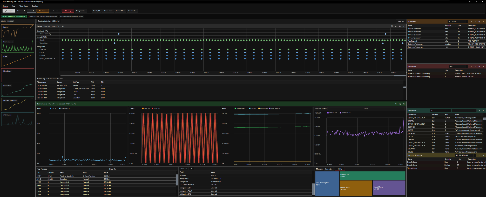
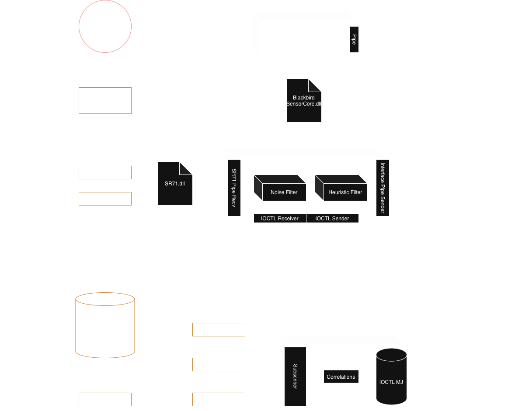

<h1 align="center">BLACKBIRD v1.7</h1>

<b>Malware Analysis DFIR Kernel Telemetry & Detection Platform for Windows</b>

  
  
  
  
  

  

# [BLACKBIRD](https://titansoftwork.com/blackbird/)

Blackbird is a malware-analysis platform for everyone from SOC teams to hobbyists. BK unifies kernel telemetry, user-mode hook data, grouped detections, and capture-backed drilldown into one platform. The analyst interface is summary-first, the raw event graph retains the full session timeline, and deeper evidence is exposed through dedicated inspectors, diagnostics, and relation views.

## OPERATOR PANEL

The main interface is the overseer of all operations, it brings these together;

- Events & Event log
- Performance counters
- Network observation
- Thread observation
- Memory observation, inspector & treemap
- Module information
- PE information
- ETW feed
- Heuristics
- Filesystem events
- Process relations
- Uplink performance
- Diagnostics cockpit
- Child process graph window

## EVIDENCE & ALTERNATE VIEWS

For deeper inspection, BK provides inspector views when double clicking collections, this will open a window showcasing the details behind the event, and raw data if asked for.

Key views include:

- **ETW Inspector**  
  Review grouped ETW occurrences and inspect enriched event details.

- **Handle Evidence**  
  Inspect suspicious handle activity, access masks, origin context, captured frames, memory region details, and related payload data.

- **Thread Stack**  
  Review stack snapshots during live capture or while moving through historical samples.

- **Process Relations**  
  See actor-to-target relationships such as suspicious opens, remote thread activity, and linked intent chains.

- **File Inpsector**
  See files accessed and created by the target.

## API HOOKING VIEW

BK provides an alternate view for seeing API hooks captured by the userland sensor in `View > Switch View`.

## COVERAGE

Representative detections include:

- direct syscalls
- handle open
- memory queries
- read & write memory
- manual mapping
- AMSI & ETW patching
- hook patching
- file dropping
- file opens, reads, creations, special attributes
- stack integrity anomalies
- thread creation
- remote thread activity outside the main image
- thread hijack and thread-context abuse
- remote APCs
- process hollowing and injection intent chains
- suspicious `ntdll` image path or mapping behavior
- multiple `ntdll` image mappings
- registry activity

For the full contract and field-level details, see [API.md](./API.md).

  

## QUICK START

See these docs for setup and usage:

- [Getting Started.md](./Getting%20Started.md)
- [INSTALL.md](./INSTALL.md)
- [USAGE.md](./USAGE.md)
- [API.md](./API.md)

Current runtime components include `blackbird.sys`, `BlackbirdController.exe`, `J58.dll`, `SR71.dll`, `BlackbirdInterface.exe`, `BlackbirdTestSuite.exe`, and `DetectionExamples.exe`.

Session archives are now written as `.bkcap`. Detection examples now live in the dedicated `DetectionExamples.exe` runner rather than the old `usage/` source set.

