# Sleepwalker

Sleepwalker is a Windows malware-analysis and endpoint-detection platform built around a KMDF telemetry driver, a broker/controller service, a shared sensor core DLL, and a native-feeling analyst interface.

  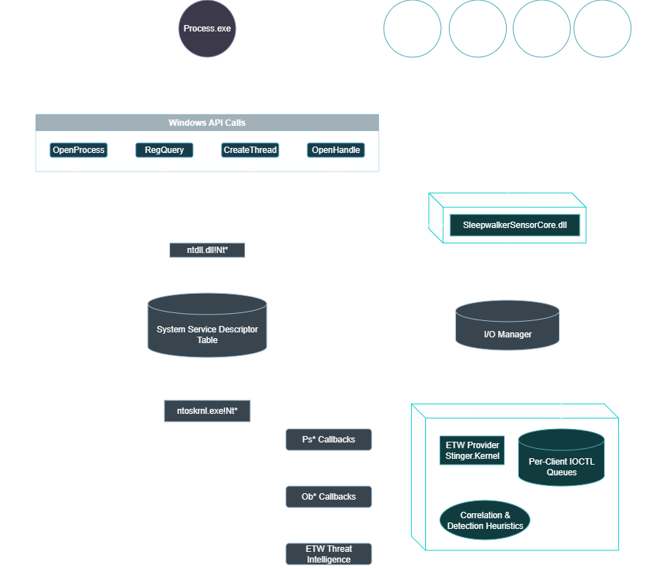

## What It Does

- Captures handle, thread, process, image, registry, APC, and detection telemetry.
- Correlates low-level intent into higher-confidence detections such as injection, hollowing, remote thread abuse, APC abuse, tamper drift, and direct-syscall abuse.
- Exposes the data through:
  - the controller/broker for live interface sessions
  - the shared `SleepwalkerSensorCore.dll` for user-mode consumers
  - CLI tools for validation and operator workflows
- Gives analysts both a live triage surface and deeper Wireshark/WPA-style inspectors for evidence-heavy telemetry.

## Platform Layout

- `kernel/`
  - KMDF driver, monitor paths, ETW emission, and kernel-side correlation
- `user/controller/`
  - Session 0 broker/service, IPC, ETW TI/session handling, correlation runtime
- `user/sensor/`
  - `SleepwalkerSensorCore.dll`, `SleepwalkerClient.exe`, `SleepwalkerTestSuite.exe`
- `interface/`
  - the WPF analyst interface used for live capture, time travel, and deep inspection
- `abi/`
  - shared IOCTL and IPC contracts

## Interface Overview

The interface is designed for malware analysis, system analysis, and endpoint detection. The main shell is a dense triage view; the inspectors are where the high-volume evidence lives.

### Main Workspace

  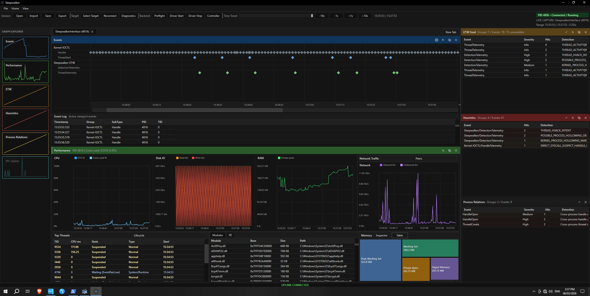

The main window is the operator cockpit:

- event timeline and event log for fast triage
- performance and memory panels for live or historical observation
- ETW, heuristics, and process-relations panes for correlated signal review
- toolbar actions for target selection, backend checks, and time travel
- session open/import/save/export for offline review and reporting

### Target Selection

  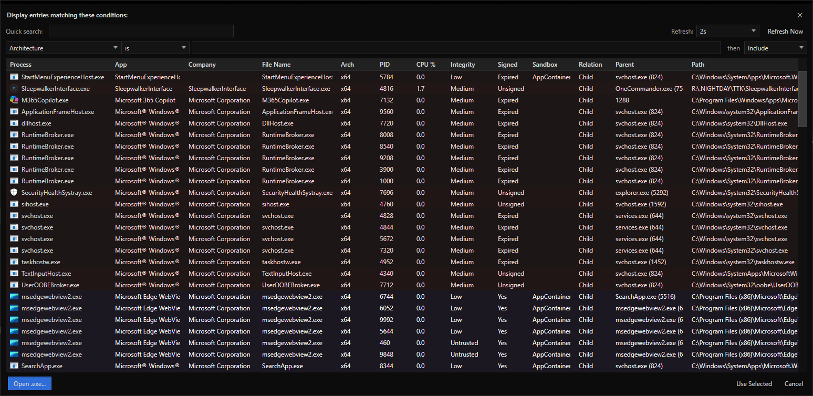

The process selector is the entry point for live observation. Operators can attach to an existing PID or use CLI launch/attach flows when deterministic startup matters.

### Detection Chain

  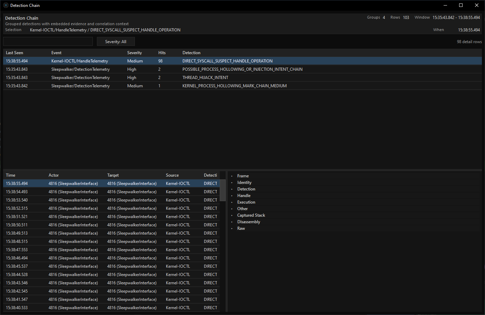

The detection chain window groups detections by event/detection key and lets the analyst pivot into the exact underlying occurrences. It is intended as the investigation surface, not just a log list.

  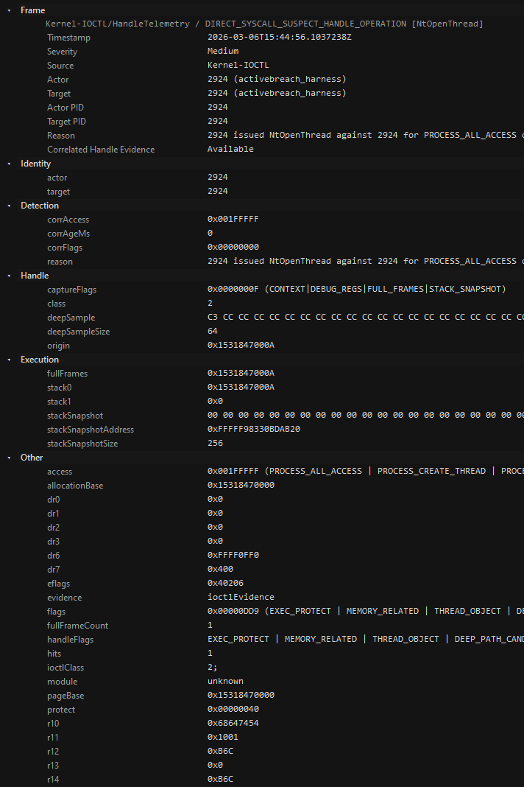
  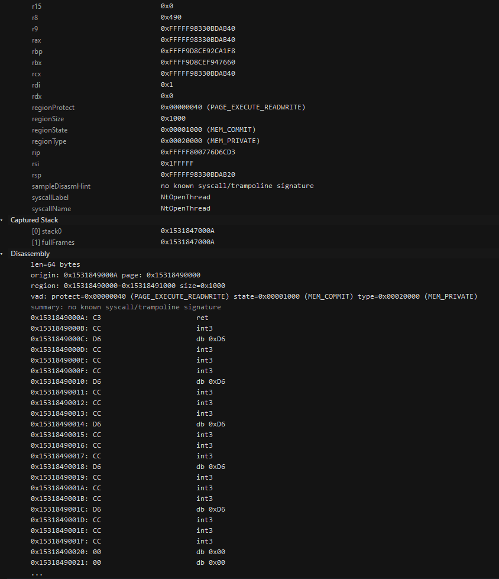

### Direct-Syscall Review

  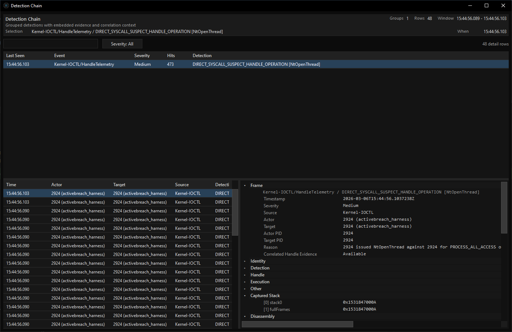

Direct-syscall suspects now surface the inferred syscall name and a short English summary so the operator can immediately see what happened before reading the raw evidence.

### ETW Inspector

  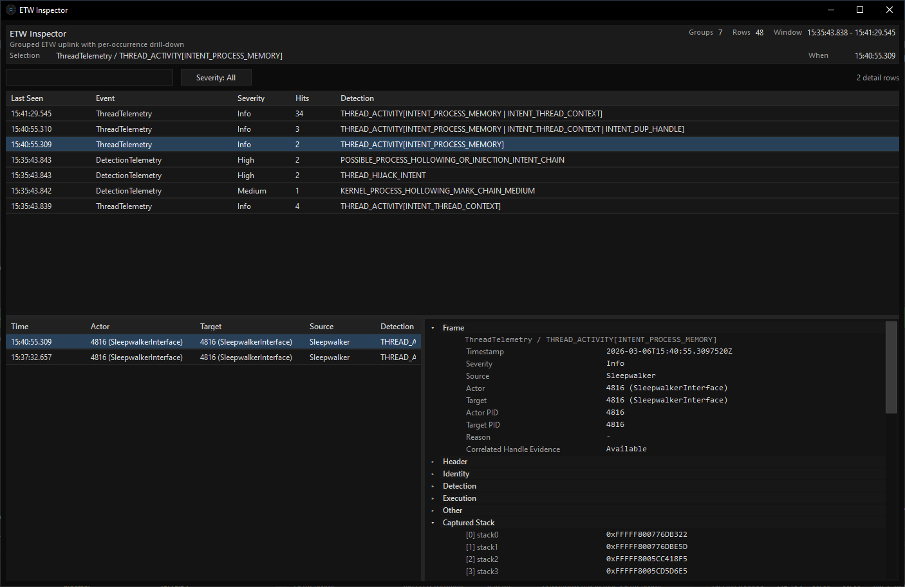

The ETW inspector follows a compact expandable-tree model:

- grouped occurrence list on the left
- selected occurrence details on the right
- expandable field sections instead of long text dumps
- capture-time disassembly and stack data when present

### Handle Evidence

  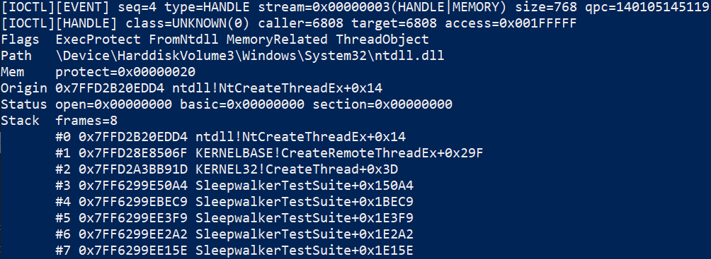

Handle evidence is the forensic view for suspicious handle activity. It exposes access masks, capture flags, region details, registers, captured frames, disassembly hints, and raw payload fields.

### Thread Stack Observation

  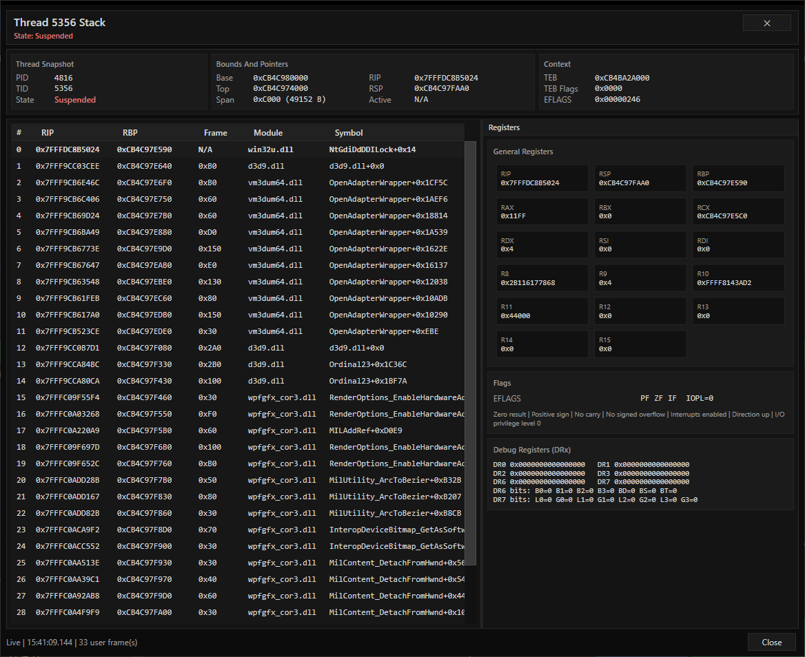

Thread stack inspection supports:

- live refresh while the target is still being observed
- historical playback when time-traveling over captured samples
- explicit `No data` states after exit when the selected time no longer has stack data

### Process Relations

  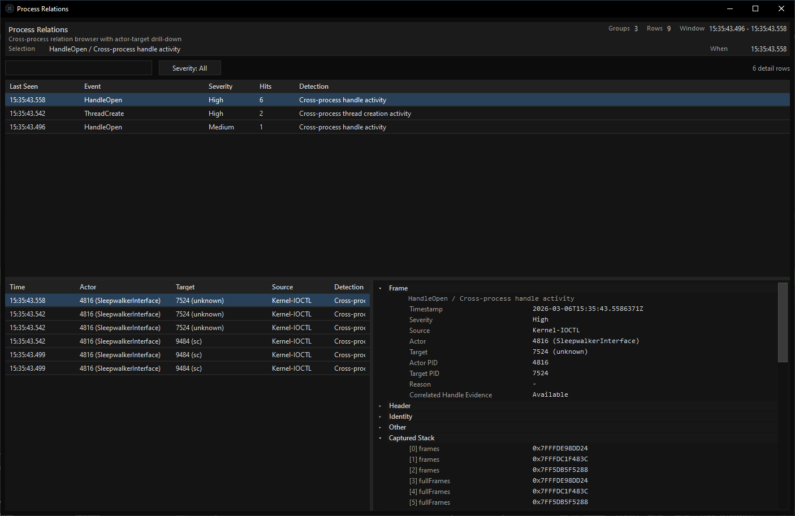

Process relations condense actor-target edges into a reviewer-friendly view for things like suspicious opens, thread creation, and correlated intent chains.

## How The UI Works

1. The operator selects a target process.
2. The interface talks to `SleepwalkerSensorCore.dll`, which uses broker IPC to reach the controller.
3. The controller owns the driver handle and ETW/TI ingestion path.
4. The interface updates the main shell with live telemetry and correlated detections.
5. When the operator scrubs time, the main panes move from live-follow to historical mode.
6. Deep inspectors provide the full evidence for the selected detection, ETW event, or handle record.
7. Sessions can be opened, imported, saved, and exported for later review or SIEM ingestion.

## Detection Coverage

Representative high-value surfaces:

- direct-syscall suspect handle operations
- stack integrity anomalies on handle operations
- remote thread creation and start-region anomalies
- thread hijack intent and thread-context abuse
- process hollowing mark chains
- remote APC creation suspects
- suspicious `ntdll` image path or mapping behavior
- high-value registry activity
- driver dispatch/object tamper drift and clear events

Full contract and field-level details are in [API.md](./API.md).

## Build Outputs

Common projects:

- `vcxproj/Sleepwalker.vcxproj`
- `vcxproj/SleepwalkerController.vcxproj`
- `vcxproj/SleepwalkerSensorCore.vcxproj`
- `vcxproj/SleepwalkerClient.vcxproj`
- `vcxproj/SleepwalkerIoctlTest.vcxproj`
- `interface/SleepwalkerInterface.csproj`

Common runtime artifacts:

- `sleepwlkr.sys`
- `SleepwlkrController.exe`
- `SleepwalkerSensorCore.dll`
- `SleepwalkerClient.exe`
- `SleepwalkerIoctlTest.exe`
- `SleepwalkerInterface.exe`

## Documentation Map

- [Getting Started.md](./Getting%20Started.md)
- [USAGE.md](./USAGE.md)
- [INSTALL.md](./INSTALL.md)
- [API.md](./API.md)
- [user/sensor/README.md](./user/sensor/README.md)
- [user/controller/core/README.md](./user/controller/core/README.md)

## Status

This branch is currently positioned as an **alpha** build. Expect active iteration across the UI, correlation model, and export/reporting flow.
