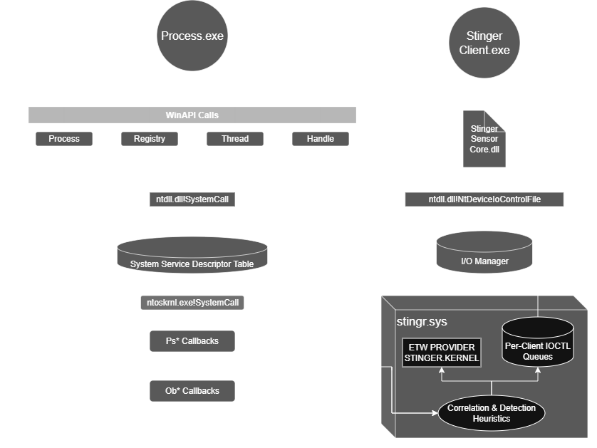

<h1 align="center">STINGER</h1>

<b>Windows Kernel Telemetry for High-Signal Threat Triage, Forensics & Malware Analysis</b>

  
  

  

---

## Executive Summary

**Stinger is a KMDF kernel telemetry driver + user-mode tooling that exposes high-value execution signals commonly associated with injection and post-exploitation.**  
It is designed for **triage, forensics, malware analysis, and threat emulation in labs/VMs** where teams need kernel-level visibility **without deploying a full EDR stack or attaching a kernel debugger**.

Stinger provides:
- **High-signal telemetry**
- **Correlation**
- **Two consumption paths**:
  - **IOCTL per-client queues** for targeted, process-scoped capture
  - **ETW provider (`Stinger.Kernel`)** for scalable ingestion and tooling

---

## What Gap It Covers

In many environments, teams end up choosing between:

1) **Generic telemetry** (high volume, hard to operationalize quickly), or  
2) **EDR detections** (high level, but hides the low-level context needed to validate intent)

**Stinger bridges that gap** by emitting telemetry that is:
- Low-level enough to preserve forensic context (access masks, addresses, call stacks, outcomes)
- Structured and testable (stable ABI, deterministic records, validation suite)
- Focused on a narrow, high-signal threat surface (injection-adjacent behavior)

> Stinger is not a replacement for an EDR.  
> It’s an **inspectable kernel telemetry plane** suitable for labs/VMs/IR triage and engineering workflows.

---

## What Questions Stinger Answers

- Which process opened another process/thread, with **what access rights**, and **from where**?
- Did a thread appear to be created remotely, and does its **start address** look suspicious relative to loaded image boundaries?
- Was there **recent intent** (process memory / thread context / duplicate handle activity) before thread execution?
- Was high-value persistence-oriented **registry activity** observed in the same run?
- What **correlated detections** can be produced when intent and execution line up?

---

## Core Signals (High Value Surface)

Stinger focuses on behavior commonly observed in:
- Process injection workflows
- Post-exploitation handle acquisition
- Remote thread creation + suspicious start regions
- Persistence-oriented registry activity

**Telemetry families:**
- Handle operations (process/thread handles, access masks, origin metadata)
- Thread execution (remote creator, start-address heuristics, execution-region context)
- Process lifecycle context
- Image load context
- High-value registry activity
- Correlated detection events (intent -> execution)

---

## Technical Highlights (for engineers)

- **KMDF control plane** with per-handle client contexts and independent event queues
- **Stable ABI header** (`abi/stinger_ioctl.h`) defining IOCTL codes + record layouts
- **Per-client subscription model**: PID + stream mask
- **Per-client sequencing + bounded queues** with drop accounting and rate-limited drop logging
- **Multi-client fanout** validated under parallel polling (`StingerTestSuite`)
- Dual output plane:
  - **IOCTL**: low-latency, targeted pull model
  - **ETW**: scalable push model for broader pipelines

---

## Interfaces

### Device Endpoints
- Preferred: `\\.\Global\StingerCtl`
- Legacy: `\\.\StingerCtl`

### IOCTL Model (Targeted Pull)
- Subscribe per client handle (PID + stream mask)
- Poll `GET_EVENT` until queue is empty (`NO_MORE_ENTRIES`)
- Query health via `GET_STATS`

### ETW Model (Scalable Push)
- Provider: `Stinger.Kernel`
- GUID: `{D6C73F8A-6AD8-4F4B-A363-3D2FA31CD0E2}`
- Event families: `HandleTelemetry`, `ThreadTelemetry`, `ProcessTelemetry`, `ImageTelemetry`, `RegistryTelemetry`, `DetectionTelemetry`

(Full contract in `API.md` and `abi/stinger_ioctl.h`.)

---

## Validation and Test Coverage

`StingerTestSuite` performs end-to-end verification:
- IOCTL subscription + event delivery
- Handle/thread intent correlation flags
- Multi-client parallel fanout
- ETW ingestion coverage across core event families

Example successful run:
- `[OK] StingerTestSuite complete. tests-passed=33/33 polls=15`

---

## Security and Scope

- Control device ACL restricted to **SYSTEM** and **Administrators**
- IOCTL control path rejects non-user-mode requestors
- Stinger is **telemetry + detection aid**, not a prevention platform
- Symbol enrichment depends on symbol availability and environment policy

---

## Repository Layout

- `kernel/`
  - `core/`: driver lifecycle and IOCTL control plane
  - `monitors/`: handle/thread/process/image/registry monitoring and correlation
  - `telemetry/`: ETW provider emission
- `abi/`
  - `stinger_ioctl.h`: shared IOCTL ABI contract
- `user/sensor/`
  - `StingerClient`: manual IOCTL subscriber
  - `StingerTestSuite`: end-to-end validation
  - `StingerEtwProc`: ETW consumer

---

## Build and Run (Lab / VM)

1. Open `Stinger.slnx` in Visual Studio.
2. Build `vcxproj/Stinger.vcxproj` (`x64` or `ARM64`).
3. Install and start the driver.
4. Run:
   - `StingerTestSuite.exe` for full validation
   - `StingerClient.exe <pid> handle,memory,thread` for targeted IOCTL capture
   - `StingerEtwProc.exe` for ETW stream output

Documentation:
- `INSTALL.md` (install/runtime workflow)
- `API.md` (IOCTL + ETW contract)
- `user/sensor/README.md` (tooling details)
