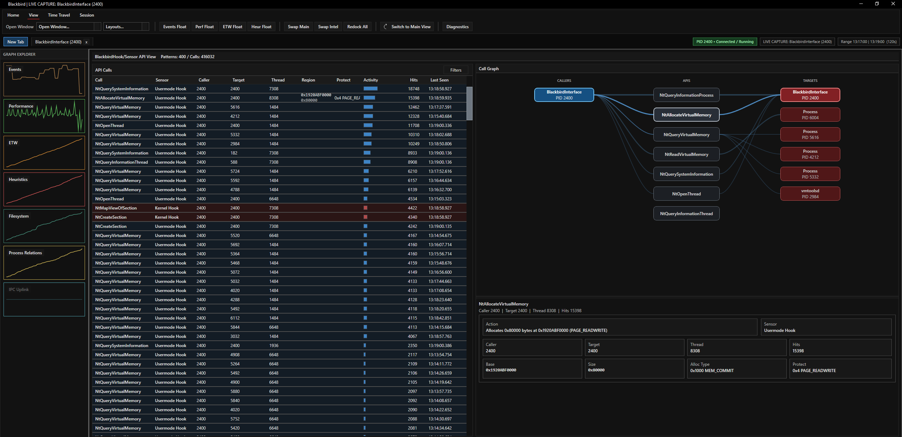

<h1 align="center">BLACKBIRD v1.7</h1>

<b>DFIR Kernel Telemetry & Detection Platform for Windows</b>

  
  
  
  
  

  
  

# BLACKBIRD

Blackbird is a malware-analysis platform that combines kernel telemetry, controller-brokered user-mode collection, hook-side telemetry, grouped detections, and capture-backed drilldown into one workflow.

## Main Surfaces

- `blackbird.sys`: kernel telemetry, concealment, and control plane
- `BlackbirdController.exe`: broker/service for the interface, ETW, node status, and hook ingest
- `J58.dll`: shared user-mode SDK used by the controller, interface, and tests
- `SR71.dll`: in-target hook/instrumentation client with ingest-only broker access
- `BlackbirdInterface.exe`: primary analyst UI
- `DetectionExamples.exe`: curated detection and benign scenario runner
- `BlackbirdTestSuite.exe`: smoke and compatibility validation harness

## Operator Views

The analysis interface exposes:

- event log and grouped detections
- performance counters and diagnostics
- ETW view and inspectors
- memory, thread, PE, and module views
- filesystem and process relation views
- heuristics and timeline/travel capture
- alternate API hooking view

## Coverage

Representative detections include:

- direct syscalls
- suspicious handle opens
- memory query/read/write/protect flows
- manual mapping and image tamper patterns
- AMSI / ETW / hook patching
- thread hijack, remote thread, and remote APC activity
- process hollowing and injection-intent chains
- suspicious `ntdll` mapping behavior
- registry persistence and security-bypass writes
- filesystem drop and open activity

For contract-level details see [API.md](./API.md).

  

## Quick Start

- [Getting Started.md](./Getting%20Started.md)
- [INSTALL.md](./INSTALL.md)
- [USAGE.md](./USAGE.md)
- [API.md](./API.md)

Session archives use `.bkcap`.