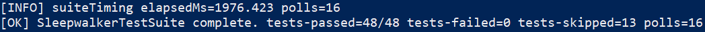

# Usage Guide

This document is a practical, task-oriented guide for using Sleepwalker in labs/VMs.

## Output Examples

Representative operator/test outputs:

  

  

Contents:

- See `usage/README.md` for example workflows and code snippets.

Quick Start (IOCTL)

1. Install and start the driver.
2. Open the control device (`\\.\Global\SleepwalkerCtl`).
3. Subscribe to a PID and stream mask.
4. Poll for events until the queue is empty.
5. Unsubscribe and close.

Quick Start (ETW)

1. Start a real-time session for `Sleepwalker.Kernel`.
2. Enable the provider.
3. Consume events via `ProcessTrace`.
4. Stop the session and clean up.

Preferred Integration Surface

Use the shared SDK in `user/sensor/sleepwalker_sensor_core.h` and link against `SleepwalkerSensorCore.dll`:

- `SLEEPWALKERSCOpenControlDevice`
- `SLEEPWALKERSCSubscribe`
- `SLEEPWALKERSCUnsubscribe`
- `SLEEPWALKERSCSetPids`
- `SLEEPWALKERSCGetEvent`
- `SLEEPWALKERSCGetStats`
- `SLEEPWALKERSCParseStreamMaskA`
- `SLEEPWALKERSCStopSessionByName`
- `SLEEPWALKERSCStartEtwSession`
- `SLEEPWALKERSCStartSleepwalkerEtwSession`
- `SwkStartDetectionEtwSession`
- `SLEEPWALKERSCRunEtwSession`
- `SLEEPWALKERSCStopEtwSession`

Typed detection callback surface:

- `SwkDetectionEvent`
- `SwkDetectionCallback`
